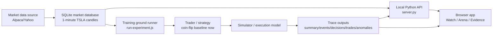
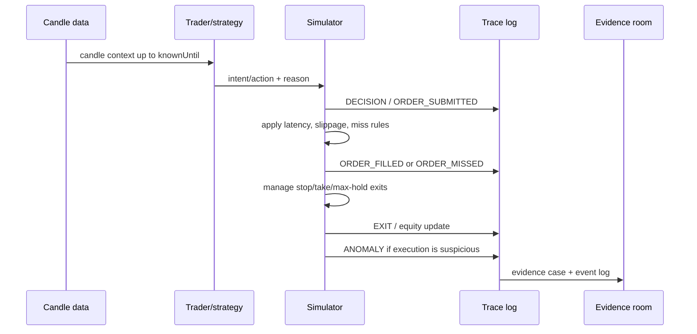
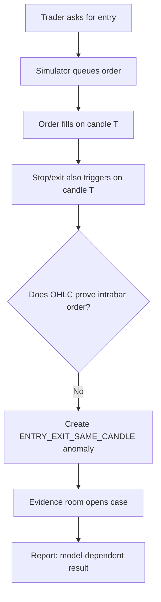

# Architecture - market replay machine

High-level map of the system as black boxes.

## One-sentence model

The machine loads historical candles, lets a trader/strategy make decisions using only known data, runs those decisions through a simulator/execution model, records every important event, and lets the UI inspect the resulting evidence.

## Black-box diagram



## Component responsibilities

| Component | Responsibility | Not responsible for |
| --- | --- | --- |
| Market data source | Provides historical candle data. | Deciding trades or simulating fills. |
| SQLite database | Stores normalized market candles locally. | Explaining strategy behavior. |
| Python API | Serves candles and training outputs to the browser. | Trading logic. |
| Browser app | Visualizes chart, story, and evidence. | Backtest truth; it only displays recorded data. |
| Training ground runner | Runs repeatable experiments over candle slices. | UI presentation. |
| Trader / strategy | Produces intent/action such as `LONG`, `SHORT`, `WAIT`. | Filling orders or deciding whether OHLC is ambiguous. |
| Simulator / execution model | Turns decisions into submitted orders, fills, exits, equity updates, and anomalies. | Predicting the market or being a smart trader. |
| Trace outputs | Record what happened and why. | Fixing the issue by themselves. |
| Evidence room | Makes trace cases readable. | Creating new simulation facts. |

## What the simulator is

The simulator is the rule engine between strategy and result.

It answers:

- When does a decision become an order?
- When does the order fill?
- At what price?
- With what latency/slippage/miss behavior?
- When does a stop/take/time exit fire?
- How does equity change?
- Is the result suspicious or model-dependent?

It is not the whole app.

It is not the chart.

It is not the trader brain.

It is the referee/accounting/execution layer.

## Simplified run lifecycle



## Same-candle incident path



## Key boundary

The simulator currently detects the same-candle issue and records it as evidence.

That means the issue is contained and visible.

It does not mean the execution model is fully fixed.

The full fix is to define stricter execution phases:

```txt
observe -> decide -> queue -> fill -> manage/exit -> settle
```

Until those phases are declared, same-candle entry/exit remains a model-dependent result.

## Where to look in code

| Area | File |
| --- | --- |
| Local API and data serving | `server.py` |
| Main app wiring | `app.js` |
| Chart rendering | `chart/price-chart.js` |
| Trace/evidence UI | `chart/trace-panel.js` |
| View modes | `chart/view-mode.js` |
| Experiment runner | `training_ground/run-experiment.js` |
| Runner wrapper | `RUN-GRIND.ps1` |
| App starter | `RUNME.ps1` |

## Related docs

- `docs/glossary.md` - vocabulary.
- `docs/case-study.md` - presentable project story.
- `docs/observability.md` - trace/evidence standard.
- `docs/decision-log.md` - chronological decisions.
